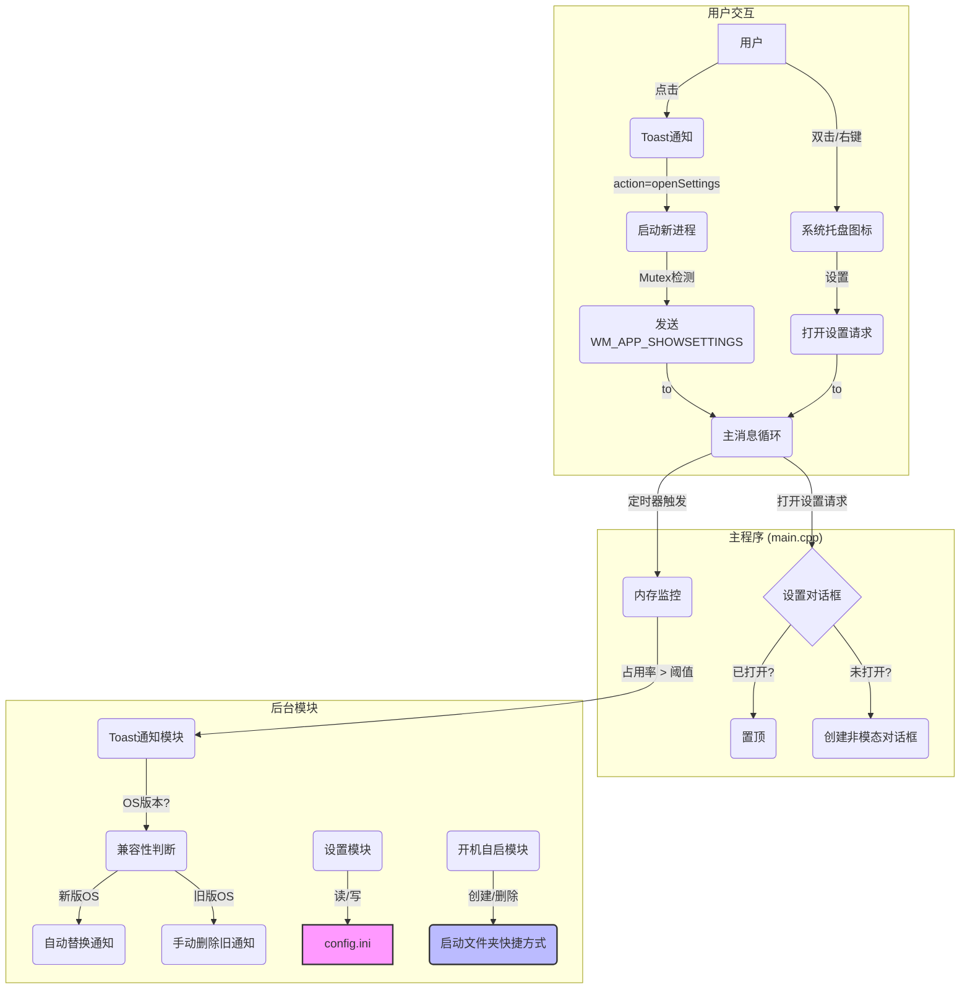

# MemAlert - 设计文档 (最终版)

## 1. 核心功能概述

- **目标**: 创建一个Windows桌面应用程序，常驻系统托盘，用于监控内存“Commit Charge”占用率。
- **触发机制**: 当内存占用率超过用户设定的阈值时，通过Toast通知进行警告。
- **用户交互**:
    - 系统托盘图标右键菜单提供“设置”和“退出”选项。
    - **双击**托盘图标可直接打开设置界面。
    - **点击**发出的Toast通知，可激活程序并打开设置界面。
- **核心配置**:
    - **警告阈值**: 用户可配置触发警告的内存占用百分比。
    - **检查频率**: 用户可配置后台监控的频率（单位：秒）。
    - **开机自启**: 用户可配置是否随Windows启动。
- **技术栈**: C++ & Win32 API (WRL for WinRT interop)。
- **配置存储**: 使用INI文件，存储于 `%APPDATA%\MemAlert\`。

## 2. 项目架构

### 2.1. 文件结构

项目采用结构化的目录，分离源代码、编译中间文件和最终输出。

```
memalert/
│
├── src/                  # 源代码和资源
│   ├── main.cpp
│   ├── Settings.cpp/.h
│   ├── SettingsDialog.cpp/.h
│   ├── ToastNotifier.cpp/.h
│   ├── StartupManager.cpp/.h
│   ├── Globals.h
│   ├── resource.h
│   ├── memalert.rc
│   └── app.ico
│
├── build/                # 编译时生成的中间文件 (.obj, .res)
│
├── bin/                  # 最终生成的可执行文件 (memalert.exe)
│
├── doc/
│   └── design_document.md
│
└── Makefile              # NMAKE 编译脚本
```

### 2.2. 模块交互图



## 3. 模块分解与技术实现细节

- **主程序模块 (`src/main.cpp`)**
    - **单例模式**: 程序启动时通过创建有名互斥体（Mutex）确保只有一个实例运行。后续实例会向主实例发送 `WM_APP_SHOWSETTINGS` 消息并退出。
    - **非模态对话框**: 使用 `CreateDialog` 创建非模态的设置对话框，并通过全局句柄 `g_hSettingsDialog` 管理其状态，实现“只打开一个”和“激活已打开窗口”的逻辑。
    - **消息循环**: 主消息循环通过 `IsDialogMessage` 为非模态对话框转发键盘消息。
    - **定时器**: 根据 `Settings` 模块提供的频率（秒）创建定时器，并在设置变更后重建定时器。

- **设置对话框模块 (`src/SettingsDialog.cpp/.h`)**
    - **UI逻辑**: 负责处理对话框的UI消息，加载当前配置到控件，并在用户点击“确定”后调用`Settings`模块保存新配置。
    - **生命周期**: 使用 `DestroyWindow` 关闭，并通过 `WM_DESTROY` 消息将全局句柄 `g_hSettingsDialog` 置为NULL。

- **设置与INI文件模块 (`src/Settings.cpp/.h`)**
    - **职责**: 封装对 `%APPDATA%\MemAlert\config.ini` 的所有读写操作，包括警告阈值、检查频率和开机自启状态。
    - **联动**: 在写入“开机自启”状态时，会直接调用 `StartupManager` 模块执行相应的文件操作。

- **开机自启模块 (`src/StartupManager.cpp/.h`)**
    - **职责**: 独立负责在Windows“启动”文件夹中创建或删除程序的快捷方式（`.lnk`）。
    - **核心API**: `SHGetFolderPathW` (CSIDL_STARTUP), `IShellLink`, `IPersistFile`。

- **Toast通知模块 (`src/ToastNotifier.cpp/.h`)**
    - **AUMID**: 通过在开始菜单创建带AppUserModelID的快捷方式来为程序注册，以支持功能完整的通知。
    - **激活**: 生成的通知XML中包含 `launch="action=openSettings"` 属性，用于点击回调。
    - **兼容性**:
        - 内置 `IsModernNotificationSystemAvailable` 函数，通过 `RtlGetVersion` 检测Windows Build版本号。
        - **新版Windows (>= 10.0.14393)**: 依赖Tag和Group实现通知的自动替换。
        - **旧版Windows**: 采用“手动删除+再发送”的后备方案，通过 `IToastNotificationHistory2::RemoveGroupedTagWithId` 实现。

- **全局变量模块 (`src/Globals.h`)**
    - 使用 `extern` 关键字为 `g_hInst` (实例句柄) 和 `g_hSettingsDialog` (对话框句柄) 提供安全的跨文件共享。

## 4. 如何编译与调试

项目使用 `NMAKE` 进行编译，并已配置好VS Code任务。

- **编译**:
    - 打开“Developer Command Prompt for VS”（或确保VS Code从此环境启动）。
    - 在VS Code中按 `Ctrl+Shift+B` (或运行 "Run Build Task...")，选择 `nmake build`。
    - `Makefile` 会自动将 `.obj` 文件输出到 `/build`，将 `.exe` 文件输出到 `/bin`。

- **清理**:
    - 在VS Code任务列表中选择 `nmake clean`，可删除 `/build` 和 `/bin` 目录。

- **调试**:
    - 在VS Code中直接按 `F5`。
    - `launch.json` 已配置好，会自动先执行 `nmake build` 任务，然后启动 `/bin/memalert.exe` 并附加调试器。
    - `OutputDebugStringW` 的输出会显示在“调试控制台”中。